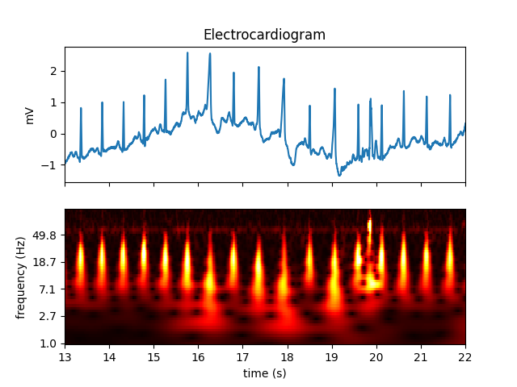

## VQT

### Installation
From PyPI: `pip install vqt`

From source:
```
git clone https://github.com/RichieHakim/vqt.git
cd vqt
pip install -e .
```

**Requirements**: `torch`, `numpy`, `scipy`, `matplotlib`, `tqdm` <br>
These will be installed automatically if you install from PyPI.
  
### Usage


```
import vqt

signal = X  ## numpy or torch array of shape (n_channels, n_samples)

model = vqt.VQT(
    Fs_sample=1000,  ## In Hz
    Q_lowF=3,  ## In periods per octave
    Q_highF=20,  ## In periods per octave
    F_min=10,  ## In Hz
    F_max=400,  ## In Hz
    n_freq_bins=55,  ## Number of frequency bins
    DEVICE_compute='cpu',
    return_complex=False,
    filters=None,  ## Use custom filters
    plot_pref=False,  ## Can show the filter bank
)

spectrograms, x_axis, frequencies = model(signal)
```


### Variable Q-Transform

This is a novel implementation of the variable Q-transform that prioritizes
accuracy and flexibility. The backend is written using PyTorch, and allows for
GPU acceleration.

#### What is the Variable Q-Transform?

The Variable Q-Transform (VQT) is a time-frequency analysis tool that generates
spectrograms, similar to the Short-time Fourier Transform (STFT). It can also be
defined as a special case of a wavelet transform, as well as the generalization
of the Constant Q-Transform (CQT). In fact, the VQT subsumes the CQT and STFT as
both can be recreated using specific parameters of the VQT.


#### Why use the VQT?

It provides enough knobs to tune the time-frequency resolution trade-off to suit
your needs.

#### How exactly this implementation differ from others?
This function works differently than the VQT from `librosa` or `nnAudio` in that
it does not use iterative lowpass filtering. Instead, it uses a fixed set of
filters, and a Hilbert transform to compute the analytic signal. It can then
take the envelope and downsample. This approach results in three key differences
from other implementations: (1) Accuracy: no artifacts in the spectrogram
associated with the iterative downsampling, (2) Flexibility: fully customizable
filter bank (3) Codebase: clean and simple PyTorch codebase that can be easily
modified.

#### What to improve on?
- Flexibility:
  - Window function: Currently, the window function is hard-coded to be a
    Gaussian. This should be made flexible and should ideally include at least
    the Hamming window.
  
- Speed: 
  - Time domain convolution is fast when the kernel is small, but slow when the
    kernel is large.
  - Unnecessary computation when downsampling. Currently, the filter bank is
    applied to the entire signal, and then downsampled via average pooling. This
    results in the highest accuracy possible, but a significant speed up can be
    achieved by downsampling the signal first, and then applying the filter
    bank.


#### Demo:


```
import vqt
import numpy as np
import torch
import matplotlib.pyplot as plt
import scipy

data_ecg = scipy.datasets.electrocardiogram()

model = vqt.VQT(
    Fs_sample=360,
    Q_lowF=3,
    Q_highF=20,
    F_min=1,
    F_max=180,
    n_freq_bins=55,
    win_size=1501,
    downsample_factor=8,
    padding='same',
    return_complex=False,
    plot_pref=True,
    progressBar=False,
)

specs, xaxis, freqs = model(data_ecg)

fig, axs = plt.subplots(nrows=2, ncols=1, sharex=True, )
axs[0].plot(data_ecg)
axs[0].title.set_text('Electrocardiogram')
axs[1].pcolor(xaxis, np.arange(specs[0].shape[0]), specs[0] * (freqs)[:, None])
axs[1].set_yticks(np.arange(specs[0].shape[0])[::5], np.round(freqs[::5], 1));
axs[1].set_xlim([43000, 48000])
axs[0].set_ylabel('mV')
axs[1].set_ylabel('frequency (Hz)')
axs[1].set_xlabel('time (s)')
plt.show()
```


